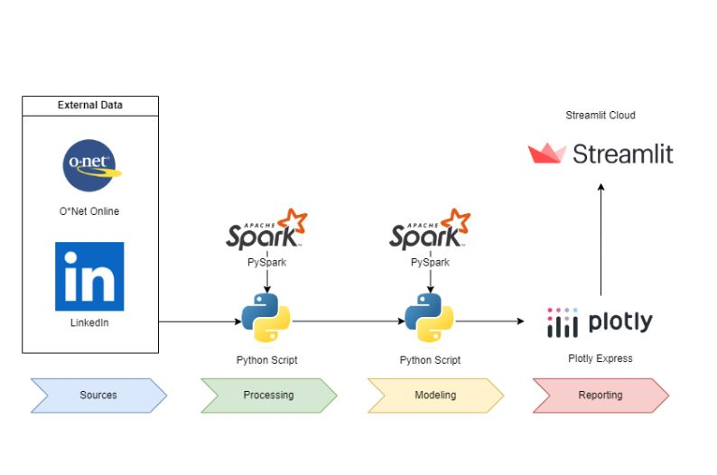

# O*Net Online Occupation Skill Requirements 

[SEE LIVE DEMO HERE](https://job-skills.streamlit.app/)



## Overview
This tool displays skill requirements of ONet Occupation Classifications used scraped LinkedIn job postings.

## Getting Started
### Prerequisites
- Python 3.8+
- PySpark
- Plotly
- Pandas

### Installation
Clone the repository and install dependencies:

```bash
git clone https://github.com/zachpinto/onet-linkedin-occupation-classifications.git
cd onet-linkedin-occupation-classifications
pip install -r requirements.txt
```

## Usage

### Data Collection
1. Download scraped LinkedIn Job Postings data from [Kaggle](https://www.kaggle.com/datasets/asaniczka/1-3m-linkedin-jobs-and-skills-2024) *Note: I did not scrape this data myself. I merely acquired it from Kaggle.*
2. Download "All Career Clusters" from [O*Net Online](https://www.onetonline.org/find/career?c=0)
3. Download "Alternate Titles" and "Sample of Reported Titles" from [O*Net Online](https://www.onetcenter.org/database.html#occ)

### Data Processing
Process LinkedIn and Occupation data files:
```bash
python src/data/process_linkedin_data.py
python src/data/process_occupation_data.py
```

### Model
To create new dataset using linkedin data and occupation classifications
```bash
python src/model/occupation_classification.py
python src/data/split_career_clusters_and_pathways.py
```

### Visualization (Optional)
Sample Plotly Express Treemap
```bash
python src/visualization/visualize.py
```

### Streamlit
Run streamlit app
```bash
streamlit run HOME.py
```

###
## License
This project is licensed under the MIT License - see the LICENSE file for details.

## Acknowledgments
- User @asaniczka for providing scraped LinkedIn Data
- O*NET Online for providing detailed occupational requirements 

## Directory Structure

```plaintext
onet-linkedin-occupation-classifications/
│
├── data/
│   ├── external/       # O*Net Online Data
│   ├── interim/        # Intermediate data processing files
│   ├── processed/      # Processed data ready for streamlit app
│   └── raw/            # Raw linkedin data
├── docs/               # Documentation files and project notes
├── reports/            # Generated analysis as HTML, PDF, LaTeX, etc.
│   └── figures/        # Generated graphics and figures to be used in reporting
├── src/                # Source code for use in this project
│   ├── __init__.py     # Makes src a Python module
│   ├── data/           # Scripts to download or generate data
│   ├── features/       # Scripts to turn raw data into features for modeling
│   ├── models/         # Scripts to train models and then use trained models to make predictions
│   └── visualization/  # Scripts to create exploratory and results oriented visualizations
├── LICENSE             # The full license description
├── Makefile            # Makefile with commands like `make data` or `make train`
├── README.md           # The top-level README for developers using this project
├── requirements.txt    # The requirements file for reproducing the analysis environment
├── setup.py            # Makes project pip installable (pip install -e .) so src can be imported
├── test_environment.py # Test python environment is set-up correctly
└── tox.ini             # tox file with settings for running tox; see tox.readthedocs.io

